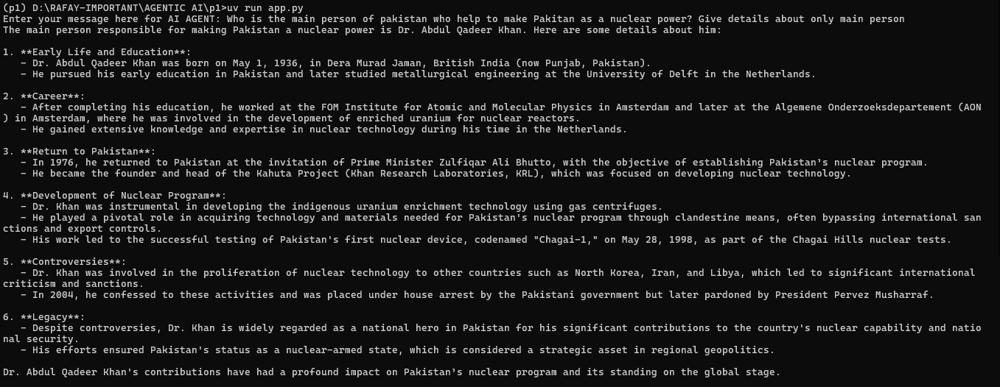

# 🤖 Hello Agent — AI Assistant using Gemini & OpenRouter by ABDUL RAFAY KHAN

Alhamdulillah! This is my first AI agent project — a command-line based conversational agent powered by both **Google Gemini** and **OpenRouter**. The agent behaves like a helpful assistant (in this case, a math teacher) and can respond to your input intelligently using powerful LLMs.

---

## 🚀 Features

* 🧐 AI Agent with personality and instructions
* 🔀 Switchable model backend: Gemini **OR** OpenRouter
* 📅 Secure API key handling using `.env`
* ⚙️ Easily configurable with RunConfig
* 🧪 Prompt-based input via terminal

---

## 🤩 Tech Stack

| Layer       | Technology                                        |
| ----------- | ------------------------------------------------- |
| Agentic AI  | `agents` framework                                |
| LLMs        | `Gemini 2.0 Flash`, `Mistral 7B` (via OpenRouter) |
| API Clients | `AsyncOpenAI`                                     |
| Config Mgmt | `dotenv`                                          |
| Runtime     | `Python 3.10+`                                    |

---

## 🔧 Setup Instructions

### 1. Clone the repo

```bash
git clone https://github.com/rktech0078/Hello-Agent/
cd Hello-Agent
```

### 2. Create & activate virtual environment (optional but recommended)

```bash
python -m venv venv
source venv/bin/activate  # On Windows: venv\Scripts\activate
```

### 3. Install dependencies

```bash
pip install -r requirements.txt
```

### 4. Create `.env` file

```env
# For Gemini
GEMINI_API_KEY=your_gemini_api_key

# For OpenRouter
OPENROUTER_API_KEY=your_openrouter_api_key
```

### 5. Run the agent

```bash
python hello_agent.py
```

---

## 📸 Demo Screenshot




---

## 💡 Example Usage

```text
Enter your message here for AI AGENT: What is the square root of 144?
Agent: The square root of 144 is 12.
```

---

## 📚 Models Used

| Model Platform | Model Name                                                         |
| -------------- | ------------------------------------------------------------------ |
| Gemini         | `gemini-2.0-flash`                                                 |
| OpenRouter     | `mistralai/mistral-7b-instruct` (can be swapped with GPT-3.5 etc.) |

---

## 🤝 Acknowledgments

* Thanks to **OpenAI agents framework** for agent orchestration.
* Powered by **OpenRouter.ai** and **Gemini Pro APIs**.
* Built with passion by [Abdul Rafay Khan](https://github.com/rktech0078) 🙌

---

## 📜 License

This project is open-source and free to use under the MIT License.


